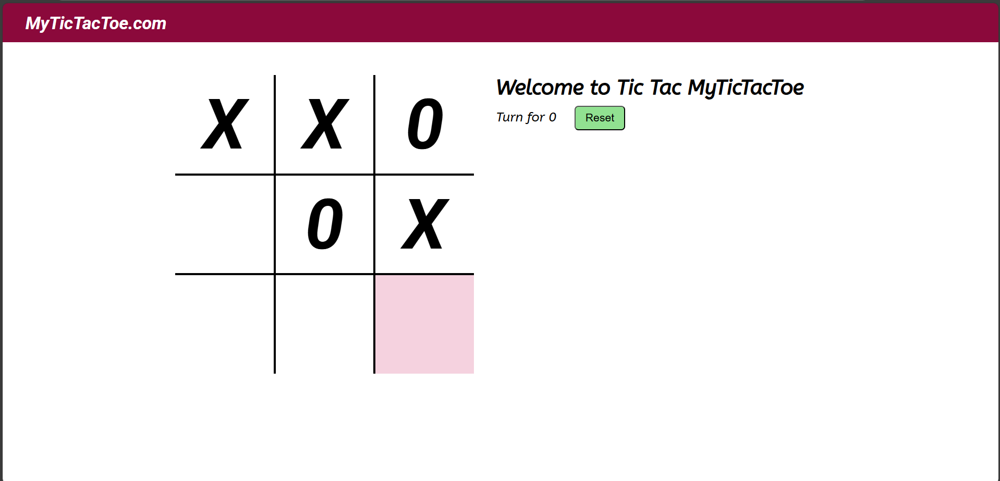

# Tic-Tac-Toe
A simple and interactive Tic Tac Toe game built with HTML, CSS, and JavaScript. It features a clean UI, turn-based logic, a reset button, and sound effects on each move for a fun user experience.

## ✨ Features

- Classic 3x3 Tic Tac Toe board
- Turn-based logic with live updates
- Sound feedback on each move
- Reset button to restart the game
- Responsive and user-friendly interface

## 📷 Screenshot

## 🛠 Technologies Used

- **HTML** – Layout and structure  
- **CSS** – Styling and animations  
- **JavaScript** – Game logic and interactions  
- **Audio** – Sound effect on cell click

## 🚀 How to Play

1. Open `index.html` in any modern browser.
2. Click on a cell to make your move (either X or O).
3. The turn alternates between players.
4. Click **Reset** to start a new game.
